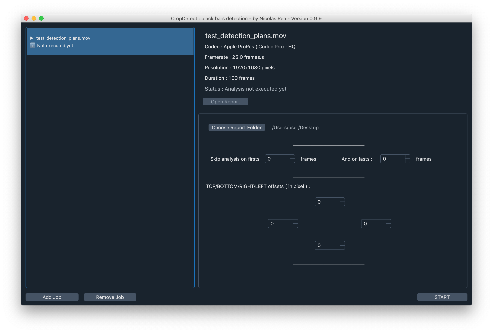
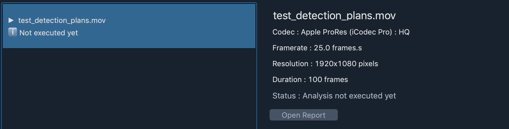
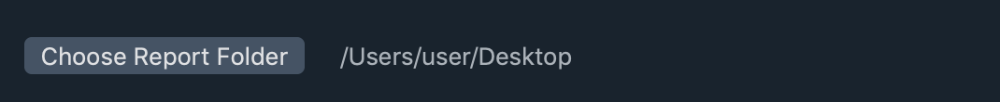
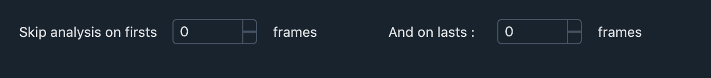
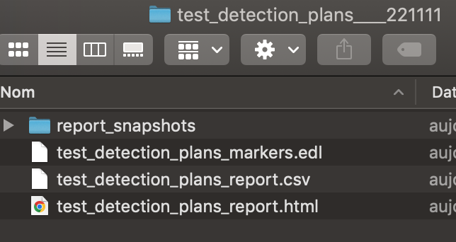
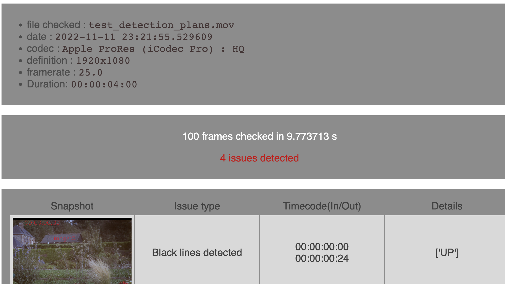
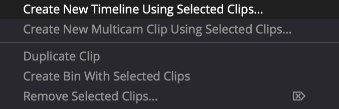
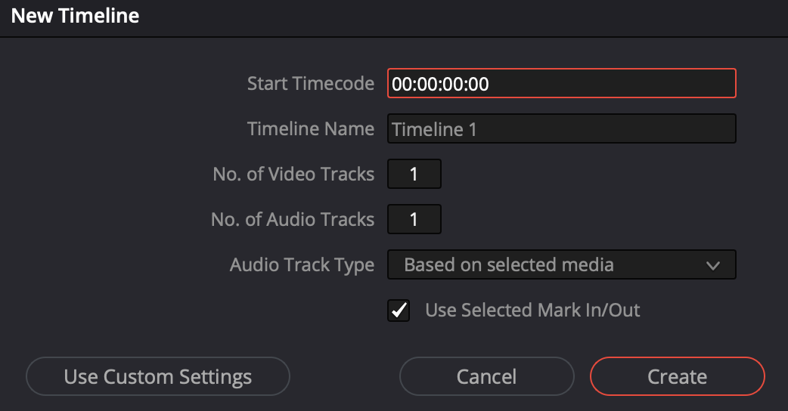
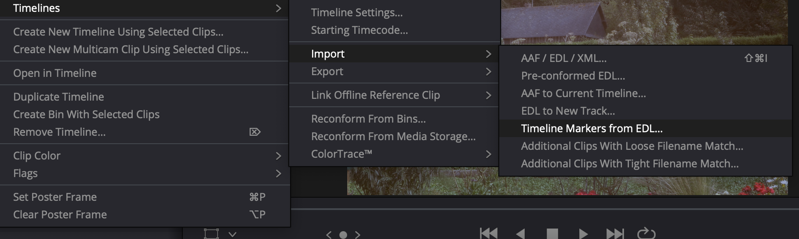
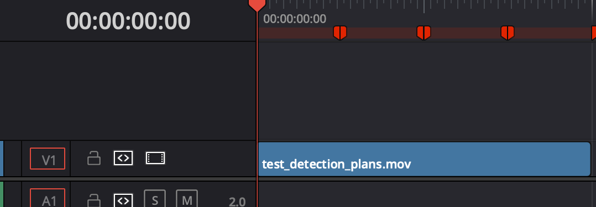

<h1 align="center"> CropDetect</h1>

<p align="center"> A program designed to detect 'bad eges', blanking issues ( inconsistency of black bars )<br>
in video files.
</p>

<hr/>

<p align="center"></p>
<p> This software's aim is to detect small black bars that can appear during the color grading process. <br>
It runs on Macos 10.14 and up. It should be possible to run it on Windows and Linux with a
few code tweaks. Let me know if you're interested
</p>

<h3> Features </h3>

<ul>
  <li>Video Codec and resolution agnostic (thanks to the ffmpeg library)</li>
  <li>Reports files as HTML and EDL to import in DaVinci Resolve</li>
  <li>Adjustable resolution offsets</li>

</ul>


<h3> Download & Installation </h3>

<h4> Download installer </h4>

<a href="https://www.dropbox.com/s/5xy6uw68wyex4oi/CropDetect.dmg?dl=0"> MacosX 10.14+ installer DMG </a>


<h4> Build from source</h4>

You must have 3.6 installed on your machine.

In an empty directory execute the following commands :

Start by cloning this repository
```shell
git clone https://github.com/NicolasReaItalo/CropDetect.git
cd CropDetect
```

Create a virtual environment
```shell
python3.6 -m venv env
source env/bin/activate
```

Upgrade pip and install the libraries

```shell
pip install --upgrade pip
pip install -r requirements.txt
```

Lauch the program with :
```shell
fbs run
```
Or buid the executable with : 
```shell
fbs freeze
```
Once the executable is built you can create an installer with : 
```shell
fbs installer
```


<h3>Usage</h3>
  <ol>
  <li>Add video files to test with the "Add job" button </li>
  <p align="center"></p>
  
  <li>Foreach job you can specify the report folder location </li>
  <p align="center"></p>
  <li> The start and end frames of th analysis </li>
 <p align="center"></p>
  <li> The pixel offsets (to avoid false positive on masters with inner blanking)</li>
 <p align="center"></p>

<li>Press the start button to begin the analysis on all the job in the queue<li>
</ol>


Once the analysis is complete, you can open the report folder.

<p align="center"> </p>

Open the html report to get a summary of the detected issues.
<p align="center"> </p>

<h3>Use the EDL file in Da Vinci Resolve</h3>

<ol>
<li>Create a new project</li>
<li>Import the tested video file</li>
<li>Create a new project</li>
<li>Create a new timeline using this clip</li>
<p align="center"> </p>
<li>The timeline start TC must be set at 00:00:00:00</li>
<p align="center"> </p>
<li>Open the timeline and import the EDL as timeline markers</li>
<p align="center"> </p>
<li>The detected issues appear as red markers on the timeline</li>
<p align="center"> </p>


</ol>
<h3> Detection method </h3>
The black bars detection is performed by slicing the outermost lines (Up,Left,Right,Down) and checking these against color level and variance tresholds.

```python
    def test_line_blanking(self, line):
        b_max = numpy.max(line[:, :, 0])
        g_max = numpy.max(line[:, :, 1])
        r_max = numpy.max(line[:, :, 2])


        if (b_max <= LUMA_TRESHOLD and g_max <= LUMA_TRESHOLD and r_max <= LUMA_TRESHOLD):

            nb_line = cv2.cvtColor(line, cv2.COLOR_BGR2GRAY)
            var_line = numpy.var(nb_line)
            if var_line <= VAR_TRESHOLD:
                return True
        return False
```


<h3>Libraries</h3>
<ul>
<li>The version of python used is 3.6</li>
  <li>The video decoding is done using the <a href="https://ffmpeg.org/"> FFMPEG library</a></li>
  <li>The calculation and dispaying are done using <a href="https://opencv.org/"> OPENCV</a> and <a href="https://numpy.org/"> NUMPY</a></li>
  <li>The packaging is done thanks to the <a href="https://github.com/mherrmann/fbs-tutorial">FBS packaging system</a></li>
</ul>


<h3>License</h3>
CropDetect is free software: you can redistribute it and/or modify it under the terms of the GNU General Public License
 as published by the Free Software Foundation, either version 3 of the License, or (at your option) any later version.

CropDetect is distributed in the hope that it will be useful, but WITHOUT ANY WARRANTY;
 without even the implied warranty
 of MERCHANTABILITY or FITNESS FOR A PARTICULAR PURPOSE. See the GNU General Public License for more details.

