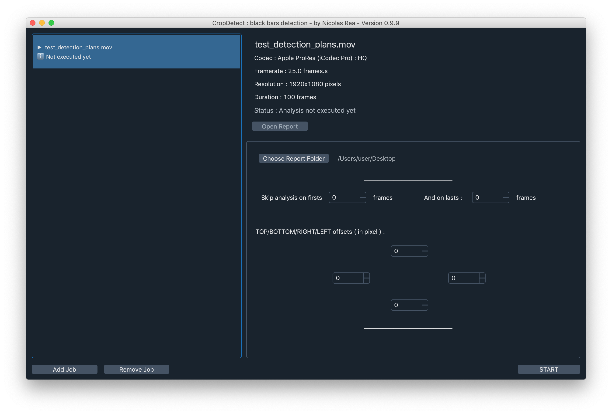

<h1 align="center"> CropDetect</h1>

<p align="center"> A program designed to detect blanking issue ( inconsistency of black bars )<br>
in video files.
</p>

<hr/>

<p align="center"></p>
<p> This software's aim is to detect small black bars that can appear during the color grading process. <br>
It runs on Macos 10.14 and up. It should be possible to run it on Windows and Linux with a
few code tweaks. Let me know if you're interested
</p>

<h3> Features </h3>

<ul>
  <li>Video Codec and resolution agnostic (thanks to the ffmpeg library)</li>
  <li>Reports files as HTML and EDL to import in DaVinci Resolve</li>
  <li>Adjustable resolution offsets</li>

</ul>
<h3> Download & Installation </h3>

<h4> Download installer </h4>

<a href="#"> MacosX 10.14+ installer DMG </a>


<h4> Package from source</h4>

```shell
pip install
```

<h3>Libraries</h3>
<ul>
  <li>The video decoding is done using the <a href="https://ffmpeg.org/"> FFMPEG library</a></li>
  <li>The calculation and dispaying are done using <a href="https://opencv.org/"> OPENCV</a> and <a href="https://numpy.org/"> NUMPY</a></li>
  <li>The packaging is done thanks to the <a href="https://github.com/mherrmann/fbs-tutorial">FBS packaging system</a></li>
<li>The stylesheet is from: <a href="https://github.com/mherrmann/fbs-tutorial">FBS packaging system</a></li>


</ul>


<h3>Roadmap</h3>
Keep it simple. Keep it minimal. Don't put every single feature just because you can.


<h3>License</h3>
CropDetect is released undur the GNU
#CropDetect is free software: you can redistribute it and/or modify it under the terms of the GNU General Public License
 as published by the Free Software Foundation, either version 3 of the License, or (at your option) any later version.

CropDetect is distributed in the hope that it will be useful, but WITHOUT ANY WARRANTY;
 without even the implied warranty
 of MERCHANTABILITY or FITNESS FOR A PARTICULAR PURPOSE. See the GNU General Public License for more details.

#You should have received a copy of the GNU General Public License along with Foobar.
 If not, see <https://www.gnu.org/licenses/>